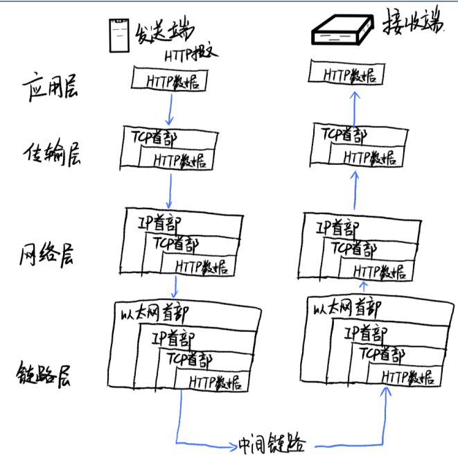

# 图解HTTP #

## 从输入 URL 到页面展示到底发生了什么？ ##
1、输入地址
- URL的地址，比如 “http://www.baidu.com/index.html?name=mo&age=25#dowell”，在这个例子中可以看到URL的组成部分：
- 传输协议：http，https
- Protocol :// hostname[:port] /path /filename

2、浏览器查找域名的 IP 地址
- 
- 什么是DNS？
- 因特网上作为域名和IP地址相互映射的一个分布式数据库，能够使用户更方便的访问互联网，而不用去记住能够被机器直接读取的IP数串。DNS就相当于一个电话本，比如你要找http://www.baidu.com这个域名，那我翻一翻我的电话本，我就知道，哦，它的电话（ip）是167.23.10.2。
- 递归解析: 如果主机所询问的本地域名服务器不知道被查询的域名的IP地址，那么本地域名服务器就以DNS客户的身份，向其它根域名服务器继续发出查询请求报文(即替主机继续查询)，而不是让主机自己进行下一步查询。
- 迭代查询: 当根域名服务器收到本地域名服务器发出的迭代查询请求报文时，要么给出所要查询的IP地址，要么告诉本地服务器：“你下一步应当向哪一个域名服务器进行查询”。然后让本地服务器进行后续的查询。

3、浏览器向 web 服务器发送一个 HTTP 请求

## 什么是TCP/IP？ ##
- TCP/IP是指能够在多个不同⽹络间实现信息传输的协议族。
- TCP/IP协议不仅仅指的是TCP和IP两个协议，⽽是指的⼀个由FTP,SMTP,TCP,UDP,IP,ARP等等协议构成的协议集合。
- 因TCP和IP最有代表性。
- 使用ARP协议凭借MAC地址进行通信 IP间通信通信依赖MAC地址。通信的双方通常会经过多台计算机和网络设备中转才能连接到对方，而在进行中转时，会利用下一站中转设备的MAC地址来搜索下一个中转目标。这时，会采用ARP协议。该协议是一种用以解析地址的协议，根据通信方的IP地址就可以反查出对应的MAC地址。

## TCP的三次握⼿ ##
- 三次握手
- 原因：为了准确无误地将数据送达目标处，TCP协议在发送数据的准备阶段采用了三次握手策略（若在握手过程中某个阶段中断，TCP协议会再次以相同的顺序发送相同的数据包）。
- 
- 

## HTTP协议在TCP/IP 协议中的数据传输 ##
- 在每个协议层下会封装发送者的信息，比如网络层的MAC地址，TCP层的
- 每⼀层中都会进⾏数据封装
- 
- 
- TCP属于传输层，提供可靠的字节流服务。 字节流服务是指：为了方便传输，将大块数据分割成以报文段为单位的数据包进行管理。 这就是为什么下载高清大图时，图片会一块一块地加载。

## TCP的四次挥⼿ ##

- 通俗的来说，两次握手就可以释放一端到另一端的 TCP 连接，完全释放连接一共需要四次握手。
- 举个例子：A 和 B 打电话，通话即将结束后，A 说 “我没啥要说的了”，B 回答 “我知道了”，于是 A 向 B 的连接释放了。但是 B 可能还会有要说的话，于是 B 可能又巴拉巴拉说了一通，最后 B 说“我说完了”，A 回答“知道了”，于是 B 向 A 的连接释放了，这样整个通话就结束了。
- 

## 问题：为什么建立连接是三次握手，而关闭连接却是四次挥手呢？  ##

4、服务器的永久重定向响应

5、浏览器跟踪重定向地址

- 现在浏览器知道了 http://www.google.com/ 才是要访问的正确地址，所以它会发送另一个http请求。
- 重复 3

6、服务器处理请求

7、服务器返回一个 HTTP 响应

## 什么是HTTP ##
- HTTP全称是：HyperText Transfer Protocol（超⽂本传输协议）
- 是⼀种基于TCP/IP通信协议来传递数据的⽹络传输协议。
- 

## HTTP具体是什么？ ##
- 

8、浏览器显示 HTML

9、浏览器发送请求获取嵌入在 HTML 中的资源（如图片、音频、视频、CSS、JS等等）

